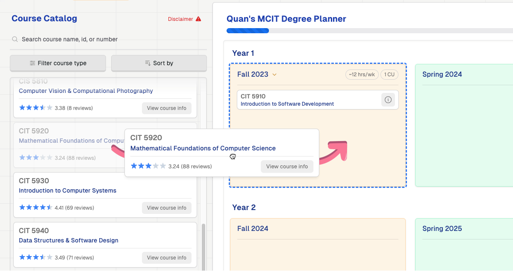
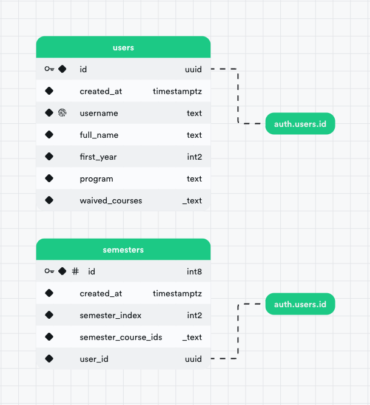

<div align="center">
  <a href="https://github.com/qu8n/PennPlanner">
    
  </a>
  <h1 align="center">PennPlanner</h1>

  <p align="center">
    A drag-and-drop course planner for students in the online Master of Computer and Information Technology (MCIT) and Master of Science in Engineering in Data Science (MSE-DS) at the University of Pennsylvania.
    <br />
    <a href="https://www.pennplanner.com/">Website</a>
    ·
    <a href="https://github.com/qu8n/pennplanner/issues/new?assignees=&labels=&projects=&template=bug_report.md&title=">Report Issues</a>
    ·
    <a href="https://github.com/qu8n/pennplanner/discussions/new?category=q-a">Ask Questions</a>
    ·
    <a href="https://github.com/qu8n/PennPlanner/discussions/new?category=feature-ideas">Suggest Features</a>
  </p>
</div>

<br />


## Features

- Drag and drop courses to plan your entire degree journey
- View full details of each course, including ratings from [MCIT Central](https://mcitcentral.com/)
- View, filter, sort, and search the entire Penn Engineering Online course catalog
- Receive warnings for missing prerequisites or other requirements in your planner

## Built with

- Typescript
- React
- Tailwind CSS
- Next.js
- Vercel Deployment
- Supabase Auth with Google OAuth
- Supabase's PostgreSQL database

## Getting started

### Prerequisites

- Node.js
- NPM
- Supabase account

### Running locally

1. Clone the repo

```sh
git clone
```

2. Install NPM packages

```sh
npm install
```

3. Create a `.env.local` file in the root directory and add the following environment variables:

```sh
NEXT_PUBLIC_SUPABASE_URL=
NEXT_PUBLIC_SUPABASE_ANON_KEY=
```

Note that for UI-only development, you might be able to opt out of using a database completely by commenting out all Supabase-related code.

4. Run the development server

```sh
npm run dev
```

### Supabase's PostgreSQL database schema

`users` table:
| Name | Data Type | Format |
| -------------- | ------------------------ | ------------ |
| id | uuid | uuid |
| created_at | timestamp with time zone | timestamptz |
| username | text | text |
| full_name | text | text |
| first_year | smallint | int2 |
| program | text | text |
| waived_courses | ARRAY | \_text |

`semesters` table:
| Name | Data Type | Format |
| ------------------ | ------------------------ | ------------ |
| id | bigint | int8 |
| created_at | timestamp with time zone | timestamptz |
| semester_index | smallint | int2 |
| semester_course_ids| ARRAY | \_text |
| user_id | uuid | uuid |

Schema visualizer:



## Contributing

Contributions are welcome! Feel free to open a pull request or submit an issue. If you need help getting started, please contact me on Slack [here](https://penn-eng-onl-students.slack.com/team/U029YJF17LG).
